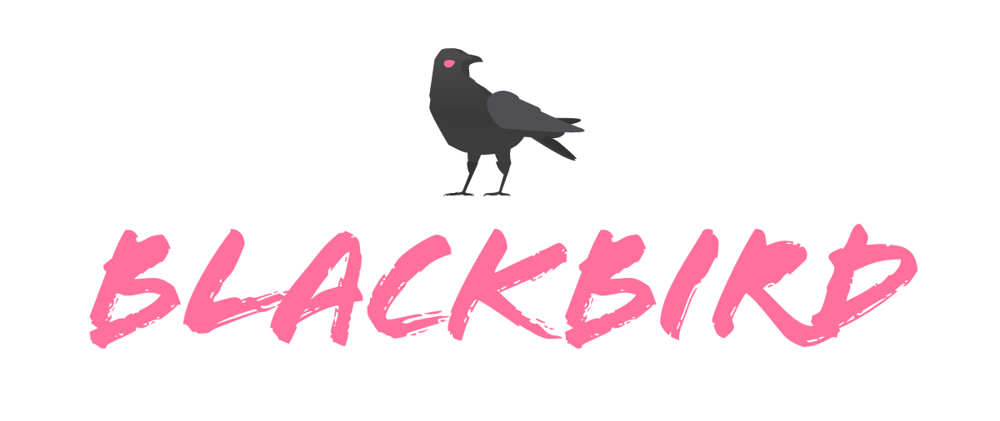
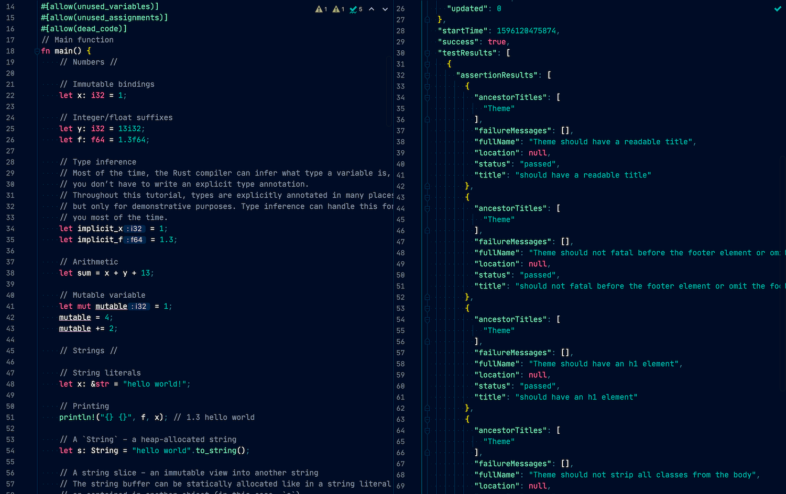
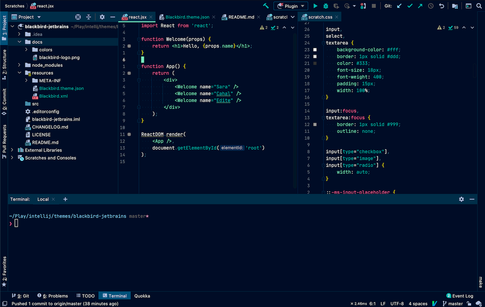
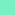
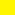

  

The Blackbird theme for <a href="https://www.jetbrains.com/products.html#type=ide">JetBrains IDEs</a>.

--- 

## The high-contrast dark theme for spellcasters

 

### Why try Blackbird?

- **High readability** with a contrast ratio of 7:1 or better for editor text (WCAG Level AAA).
- **A simple palette** to reduce visual overload in the editor.
- **Good default font settings** with JetBrains Mono at size 15 and 1.1 line spacing. No italics. Ligatures in the editor but not in the terminal.
- **Reduced distractions** with stripe marks for errors only, instead of for errors, warnings, weak warnings, and others. 
- **Text editor looks** with a unified background color and minimal borders.
- **Lightweight** implementation as a pure theme with no plugin requirements.

### Advice for Mac users

To make the Mac title bar match the color of the theme: 

1. Help → Edit Custom Properties…
2. Create the `idea.properties` file if prompted. 
3. Add this line to the file, save, and restart: `ide.mac.transparentTitleBarAppearance=true`

### Advice for minimalists

- Turn off the toolbar, navigation bar, and tool window bars (View → Appearance). 
- Try turning off tabs (Editor → General → Tabs → Tab Placement → none). Then navigate with Search Everywhere (Shift Shift), Open Files (Ctrl/Cmd + Shift + O), (Recent Files (Ctrl/Cmd + E), or set up [IdeaVim bindings to cycle through tabs/buffers](https://gist.github.com/nickcernis/bcb5cb7f55c07ed3de8287d163ed7c28#file-ideavimrc-L55-L58).
- Keep the Project tool window closed unless you need a tree view. 

### Change the default font
1. Uncheck “Use color scheme font…” at Editor → Color Scheme → Color Scheme Font. 
2. Set your font at Editor → Font.

### AceJump colors
If you use [AceJump](https://plugins.jetbrains.com/plugin/7086-acejump), set colors manually at Preferences → Tools → AceJump:

- Jump mode color: ff7883
- Tag background color: 97ecc7
- Tag foreground color: 011529
- Target mode color: ff7883
- Text highlight color: 1d5278

### Credits

- Blackbird name and color scheme inspired by the [Blackbird comic](https://imagecomics.com/comics/releases/blackbird-2) artwork by Jen Bartel.
- Background color and aesthetic inspired by the [Night Owl theme](https://github.com/sdras/night-owl-vscode-theme) by Sarah Drasner.
- “Blackbird“ (Raven) icon by [Imogen Oh](https://www.iconfinder.com/Imogen.Oh), licensed via Iconfinder.
- The Blackbird header in this readme is set in [Flood Std Regular](https://fonts.adobe.com/fonts/flood) by Joachim Müller-Lancé.

### Color palette

| Color | Native (JetBrains) | sRGB (Electron/VS Code/iTerm) |
|---|---|---|
|  midnight | #051527| #011528 |
|  portal | #97ecc7 | #79efc4 |
|  nevermore | #34b5b3 | #00b8b4 |
|  potion | #ff709d | #ff639d |
|  obliterate| #fff423 | #fff500 |
|  spirit | #ffffff | #ffffff |
|  limbo | #8995ac | #8695ae |

For tints and other colors see `resources/Blackbird.theme.json` and `resources/Blackbird.xml`. Colors in these files use native color space. You will need to convert to sRGB if designing for an application that uses sRGB color space. On Mac, the Digital Color Meter can help to determine the app's color space.
